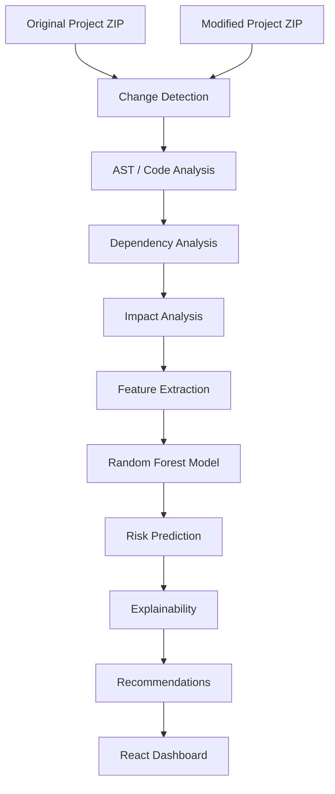

# JavaScript/React Change Impact Analysis System

## Problem
When JavaScript/React code changes, developers need to understand:
* **What changed:** Identifying specific file and line modifications.
* **What files/functions may be affected:** Tracing the ripple effect of a change across the codebase.
* **How risky the change is:** Determining the likelihood of introducing bugs or regressions.
* **What action should be taken:** Figuring out what needs to be reviewed, tested, or refactored.

## Solution
This system automatically analyzes code changes between an original and modified project. It constructs an Abstract Syntax Tree (AST) to understand code semantics, maps out dependencies, evaluates the downstream impact, and uses a Random Forest machine learning model to predict the risk level of the changes, providing actionable recommendations to developers.

## Key Features
* Change Detection
* AST-based Code Analysis
* Dependency Analysis
* Impact Analysis
* Feature Extraction
* Random Forest Risk Prediction
* LOW/MEDIUM/HIGH Risk Classification
* Risk Probabilities
* Why This Risk Explainability
* Recommendations
* Project Explorer
* Impact Graph

---

## Architecture



### Responsibilities
* **Frontend (React/Vite):** Provides the UI for uploading projects, rendering interactive graphs, and displaying risk and impact metrics.
* **Backend (Node.js/Express):** Handles zip extraction, change detection, AST parsing, dependency mapping, impact analysis, and feature extraction. Serves as the orchestrator.
* **ML Server (Python/Flask):** Hosts the pre-trained Random Forest model and provides an API endpoint for predicting risk and extracting feature importances based on the features extracted by the Node backend.

---

## Technology Stack
* **Frontend:** React, JavaScript, Vite, `@xyflow/react` (graph visualization), `@dagrejs/dagre` (graph layout)
* **Backend:** Node.js, Express, `multer` (file upload), `unzipper`, `diff`
* **Machine Learning:** Python, Flask, `scikit-learn` (Random Forest Classifier)

---

## Project Structure

```text
frontend/
  src/
    components/      # Reusable UI components (Graph, RiskCard, ExplorerGraph)
    pages/           # Application views (Dashboard, RiskPrediction, ProjectExplorer)
backend/
  controllers/       # Express route handlers (analysisController.js)
  routes/            # Express routes (analysisRoutes.js, mlRoutes.js)
  services/          # Core analysis logic (changeDetection, featureExtractor, etc.)
  ml/                # Python ML API, model training, and dataset building
  tests/             # Automated test suite using Node native test runner
```

---

## ML Explanation

### Input
The system extracts 17 code/change-related features via AST and dependency analysis:
`changedLines`, `addedLines`, `removedLines`, `changedFunctions`, `changedVariables`, `directDependencies`, `indirectDependencies`, `totalDependencies`, `businessLogic`, `stateChange`, `uiChange`, `apiChange`, `routingChange`, `stylingChange`, `eventHandlingChange`, `isJavaScript`, `isCSS`.

### Model
A Scikit-Learn `RandomForestClassifier` trained on synthetic datasets based on rule-based heuristics.

### Output
Risk classification (`LOW`, `MEDIUM`, `HIGH`) along with specific probabilities for each class.

### Explainability
The system currently uses the Random Forest's global `feature_importances_`.
> **IMPORTANT:** Explicitly, these are GLOBAL model feature importances. They represent what the model prioritizes across the entire dataset. They are **NOT** local explanations for an individual file and do not definitively prove causality for a specific risk prediction.

---

## Important ML Limitation
> **LIMITATION:** The current training labels are generated using deterministic rule-based heuristics (in `prepare_dataset.py`). 
> 
> Therefore, the approximately 1.00 evaluation accuracy demonstrates that the model successfully learned the synthetic labeling rules. It should **NOT** be interpreted as 100% real-world prediction accuracy. 
> 
> Furthermore, the current "Why This Risk?" panel surfaces the global feature importance of the Random Forest. As a result, feature importance values may be the same across different files. This is an expected limitation of using a global explainer rather than a local one (like SHAP).

---

## Installation & Running

### Backend
Navigate to the backend directory and start the Node server:
```bash
cd backend
npm install
node server.js
```
*(Runs on port 5000)*

### ML Server
Navigate to the ML directory and start the Flask API:
```bash
cd backend/ml
python predict_api.py
```
*(Runs on port 8001)*

### Frontend
Navigate to the frontend directory and start the Vite dev server:
```bash
cd frontend
npm install
npm run dev
```
*(Runs on port 5173)*

---

## Testing

To run the backend test suite, use the Node native test runner:
```bash
cd backend
npm test
```
**Results: 13 tests passed, 0 failed.**

These automated tests cover the core analysis pipeline (Change Detection, Feature Extraction, Impact Analysis, and Integration). 
*Note: End-to-end UI validation is performed manually.*

---

## Demo Workflow

1. Start backend
2. Start ML server
3. Start frontend
4. Upload original project
5. Upload modified project
6. Run analysis
7. Show changed files
8. Show Impact Analysis
9. Show Risk Prediction
10. Select a file
11. Show Why This Risk
12. Show Recommendations
13. Show Impact Graph

---

## Demo Talking Points

**Script Summary (~3-5 minutes):**
> "A developer changes a React project. Instead of manually tracing dependencies and guessing what might break, our system automatically identifies the changes, analyzes their impact, estimates risk, explains the model's reasoning, and recommends what to inspect."

1. **The Problem:** "Tracing changes manually in large React codebases is error-prone and time-consuming."
2. **The Automation:** "We just upload the original and modified code. The system parses the AST, maps out every import and dependency, and highlights exactly what was touched."
3. **The Intelligence:** "Our Random Forest model looks at 17 different code features—from how many functions changed to whether it touched core business logic—to assign a Risk Score."
4. **The Explanation:** "It doesn't just give a score; it explains *why* using feature importances, so developers can trust the output."
5. **The Value:** "Finally, it surfaces actionable recommendations, turning raw code changes into a prioritized code review checklist. We save time, prevent bugs, and make code review objective."


Group 1: Change-Size Features (Change size measure pannradhu) — 8 features
#	Feature	Enna measure pannum
1	changedLines	-Total எத்தனை lines change aachu
2	addedLines	-Puதுசா add pannna lines எத்தனை
3	removedLines	-Delete pannna lines எத்தனை
4	changedFunctions-	எத்தனை functions change aachu
5	changedVariables-	எத்தனை variables change aachu
6	directDependencies-	Andha file-a direct-a use panra files எத்தனை
7	indirectDependencies	-Indirect-a (2nd level) affect aagra files எத்தனை
8	totalDependencies	-Direct + indirect total


Group 2: Change-Category Flags (Enna type change nu identify pannradhu) — 7 features

Idhu ella "1 or 0" values (yes/no):

#	Feature	Enna check pannum
9	businessLogic	-Calculation/business logic touch panniyacha (1) illaya (0)
10	stateChange-	React state (useState) touch pannichaa
11	uiChange	-UI/JSX components touch pannichaa
12	apiChange	-API call (fetch, axios) touch pannichaa
13	routingChange	-Routing/navigation touch pannichaa
14	stylingChange	-CSS/styling touch pannichaa
15	eventHandlingChange	-onClick/onChange event touch pannichaa

Group 3: File-Type Flags (File edhu type nu solradhu) — 2 features
#	Feature	Enna check pannum
16	isJavaScript	
17	isCSS	File .